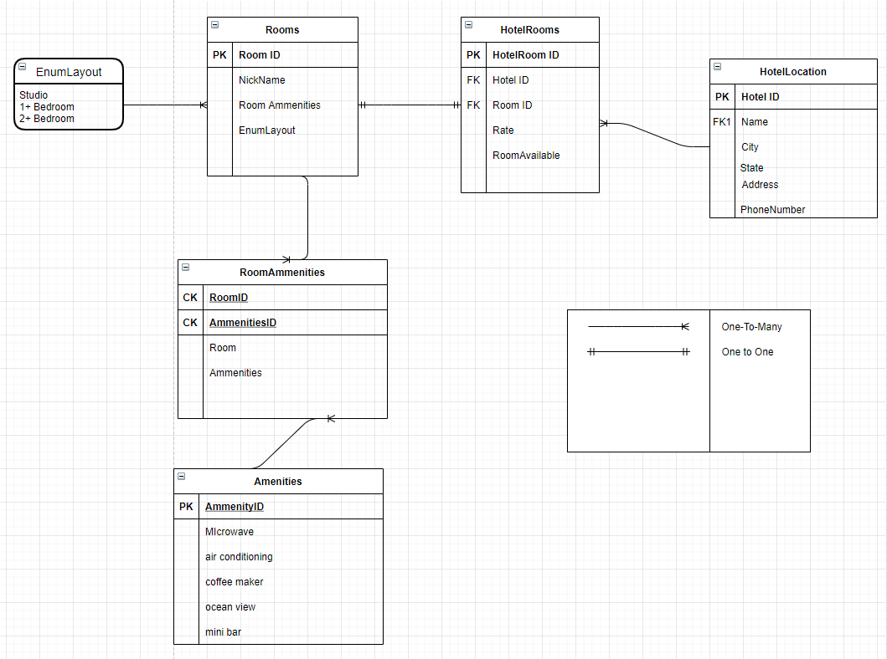

# Async-Inn

**Author**: Matthew Petersen, David Dicken and Michael Falk

**Version**: 1.0 - 1/25/2021

## Overview

Here is an ERD for our Async-Inn. 

1. Hotels have a Many:1 relationship with HotelRooms. (One hotel has many rooms)
2. HotelRoom has a 1:1 relationship with Rooms. (Room is the constructor for hotelRooms)
3. We utilize an enum for our room layout, which has a 1:Many relationship. (one layout can belong to many rooms)
4. Rooms has a 1:Many relationship to RoomAmmenities. (One room may have many roomammenities)
5. Ammenities has a Many:1 relationship with RoomAmmenities. (Ammenities is the constructor for roomAmmenities)

Join table is our RoomAmmenities. It joins a RoomID to AmmenitiesID.

